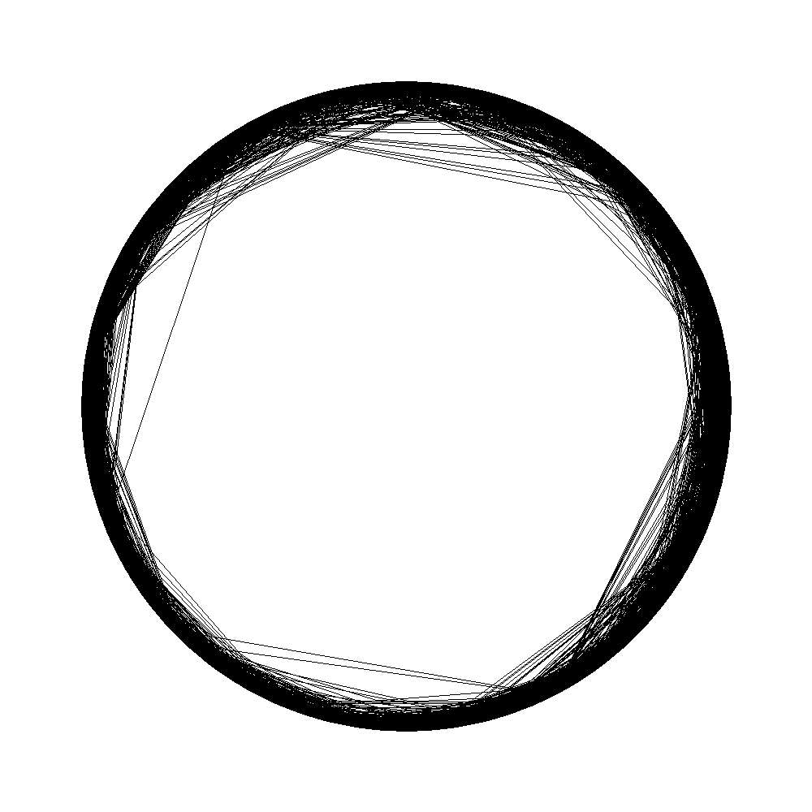
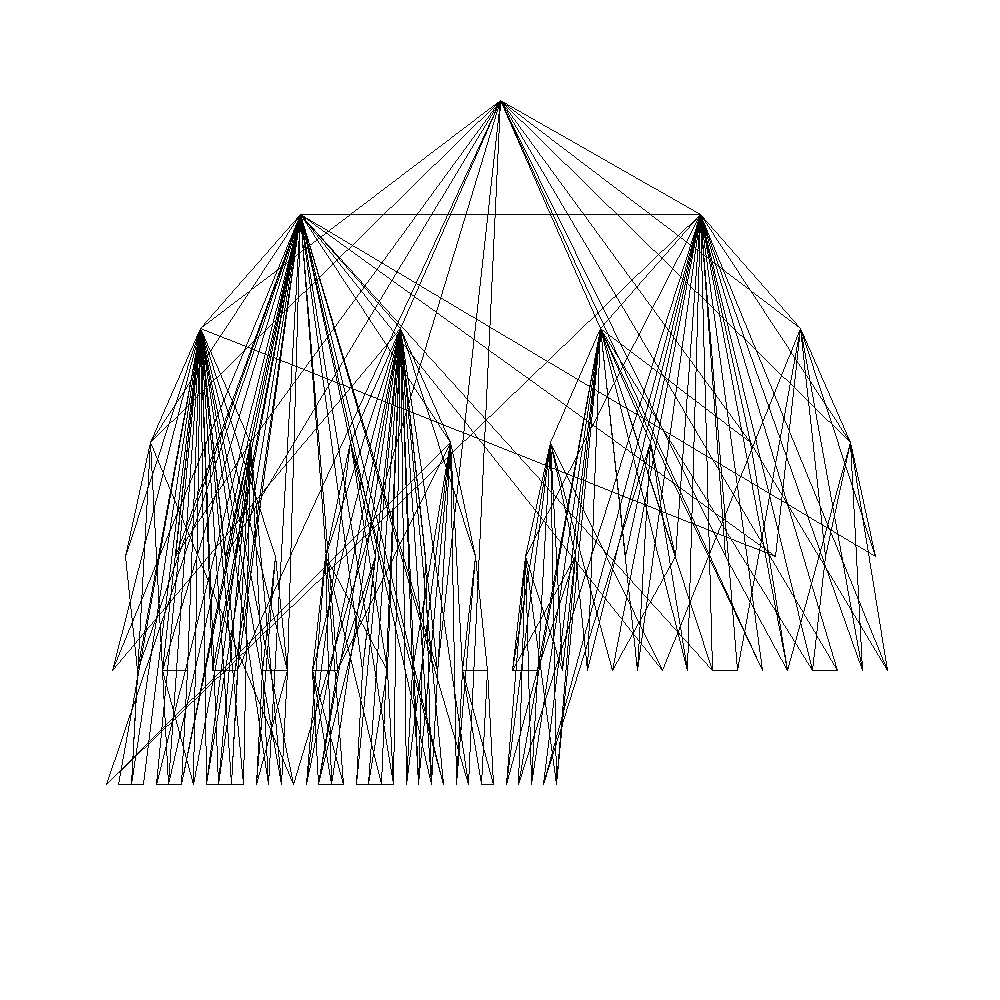
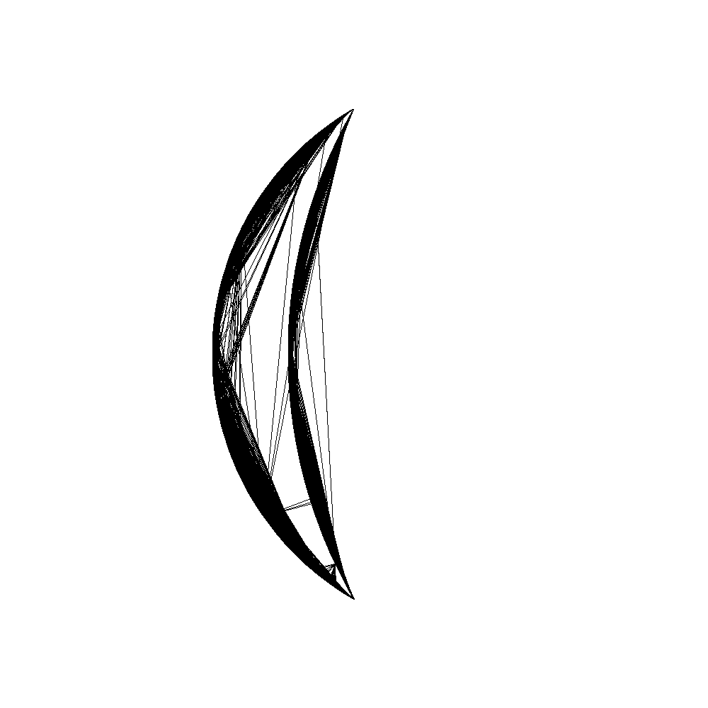

# Description

This is a implementaion of T-MAN protocal. It's also the solution for assignment 1 of EEL6935 Distributed Computing, University of Florida, spring 2017.

>Overlay topology plays an important role in P2P systems. Topology serves as a basis for achieving functions such as routing, searching and information dissemination, and it has a major impact on their efficiency, cost and robustness. Furthermore, the solution to problems such as sorting and clustering of nodes can also be interpreted as a topology. In this paper we propose a generic protocol, T-Man, for constructing and maintaining a large class of topologies. In the proposed framework, a topology is defined with the help of a ranking function. The nodes participating in the protocol can use this ranking function to order any set of other nodes according to preference for choosing them as a neighbor. This simple abstraction makes it possible to control the self-organization process of topologies in a straightforward, intuitive and flexible manner. At the same time, the T-Man protocol involves only local communication to increase the quality of the current set of neighbors of each node. We show that this bottom-up approach results in fast convergence and high robustness in dynamic environments. The protocol can be applied as a standalone solution as well as a component for recovery or bootstrapping of other protocols.

You can find the paper here: [T-Man: Gossip-based Overlay Topology Management](http://www.cs.unibo.it/babaoglu/papers/pdf/tman)

# Complie 

This is the information of my virtual machine.

operating system:

	Linux wrtUbuntu 4.4.0-59-generic #80-Ubuntu SMP Fri Jan 6 17:47:47 UTC 2017 x86_64 x86_64 x86_64 GNU/Linux
	Ubuntu 16.04.1 LTS \n \l

compiler version:

	g++
	gcc version 5.4.0 20160609 (Ubuntu 5.4.0-6ubuntu1~16.04.4) 

For compling just type in bash:

	make
	
# Usage

In this algorithm, every node in the network maintains a list of neighbors. During the network-initialization phase, each node randomly selects k neighbors and places them into its neighbor list. During the networkevolution phase, in each cycle of the iterative algorithm, every node randomly selects one of its neighbors, and then sends a list consisting of the identifiers of its neighbors and of itself to that neighbor. The selected neighbor also sends its neighbors list back to the node which initiated the action. Upon receiving the new neighbor list, the nodes select the nearest k nodes from both the new and old lists as their neighbors and discards all the others.

The output of the program is the sum of distance for each cycle. For 1, 5, 10, 15 and 50 cycles the program produces the node graph files in bitmap and a file that contains the neighbor list for each node.

## Dynamic Ring

Program will generate a ring topology.

Type in bash
	
	./TMAN N k D n r1 r2 r3 r4 .....

N, the total number of nodes in the network, k, the number of neighbors each node maintains, D, the type of target topology which is exactly D in this case, n, the number of radius values, r1, r2, r3…, the sequence of ‘r’ values whose total number is specified by the above n. The value of r is reread every 5 iterations. program adapts (i.e. changing the old value of r to the new value  of r) in order to generate the ring whose radius is the last input value of r. However, this adaptation can only be done by incrementing the radius by one in every 3 iterations. 

## Binary Tree

Program will generate a binary tree topology.

Type in bash:

	./TMAN N K B
	
N, the total number of nodes in the network, k, the number of neighbors each node maintains, B, the type of target topology which is exactly B in this case.

## Crescent Moon

Program will generate a crescent moon topology.

Type in bash:

	./TMAN N K C

N, the total number of nodes in the network, k, the number of neighbors each node maintains, C, the type of target topology which is exactly C in this case.

# Examples

Type 

	./TMAN 1000 30 D 5 1 4 5 8 10
	
Node graph of cycle 50:

Type in bash:

	./TMAN 100 3 B
	
Node graph of cycle 50:

Type in bash:

	./TMAN 1000 30 C
	
Node graph of cycle 50:

# Structure
There are mainly 3 parts in this program.

TMAN.cpp:

Main fuctions for this program. It reads arguments and constructs Topology class instance. It will conduct different operations accroding to differentinput arguments.

Topology.cpp & TOpology.hpp:
	
Defination and declarition of Topology class.

EasyBMP:
	
	
It's a portable bmp image processing library. I use it in Topology.cpp to generate bmp file.
